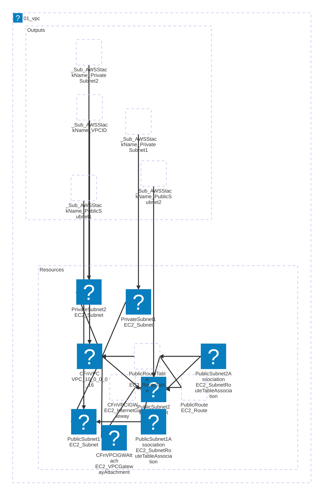

```mermaid
architecture-beta
  group 01_vpc(logos:aws-cloudformation)[01_vpc]
  group resources[Resources] in 01_vpc
  group outputs[Outputs] in 01_vpc

  %% Resources
  service CFnVPC(logos:aws-vpc)[CFnVPC VPC_10_0_0_0_16] in resources
  service PublicSubnet1(logos:aws-batch)[PublicSubnet1 EC2_Subnet] in resources
  service PublicSubnet2(logos:aws-batch)[PublicSubnet2 EC2_Subnet] in resources
  service PrivateSubnet1(logos:aws-batch)[PrivateSubnet1 EC2_Subnet] in resources
  service PrivateSubnet2(logos:aws-batch)[PrivateSubnet2 EC2_Subnet] in resources
  service CFnVPCIGW[CFnVPCIGW EC2_InternetGateway] in resources
  service CFnVPCIGWAttach(logos:aws-vpc)[CFnVPCIGWAttach EC2_VPCGatewayAttachment] in resources
  service PublicRouteTable[PublicRouteTable EC2_RouteTable] in resources
  service PublicRoute[PublicRoute EC2_Route] in resources
  service PublicSubnet1Association(logos:aws-batch)[PublicSubnet1Association EC2_SubnetRouteTableAssociation] in resources
  service PublicSubnet2Association(logos:aws-batch)[PublicSubnet2Association EC2_SubnetRouteTableAssociation] in resources

  %% Outputs
  service param__VPCID[_Sub_AWSStackName_VPCID] in outputs
  service param__PublicSubnet1[_Sub_AWSStackName_PublicSubnet1] in outputs
  service param__PublicSubnet2[_Sub_AWSStackName_PublicSubnet2] in outputs
  service param__PrivateSubnet1[_Sub_AWSStackName_PrivateSubnet1] in outputs
  service param__PrivateSubnet2[_Sub_AWSStackName_PrivateSubnet2] in outputs

  %% Edges
  PublicSubnet1:L --> R:CFnVPC
  PublicSubnet2:L --> R:CFnVPC
  PrivateSubnet1:L --> R:CFnVPC
  PrivateSubnet2:L --> R:CFnVPC
  CFnVPCIGWAttach:L --> R:CFnVPCIGW
  CFnVPCIGWAttach:L --> R:CFnVPC
  PublicRouteTable:L --> R:CFnVPC
  PublicRoute:L --> R:CFnVPCIGW
  PublicRoute:L --> R:PublicRouteTable
  PublicSubnet1Association:L --> R:PublicSubnet1
  PublicSubnet1Association:L --> R:PublicRouteTable
  PublicSubnet2Association:L --> R:PublicSubnet2
  PublicSubnet2Association:L --> R:PublicRouteTable
  param__VPCID:B --> T:CFnVPC
  param__PublicSubnet1:B --> T:PublicSubnet1
  param__PublicSubnet2:B --> T:PublicSubnet2
  param__PrivateSubnet1:B --> T:PrivateSubnet1
  param__PrivateSubnet2:B --> T:PrivateSubnet2

```
