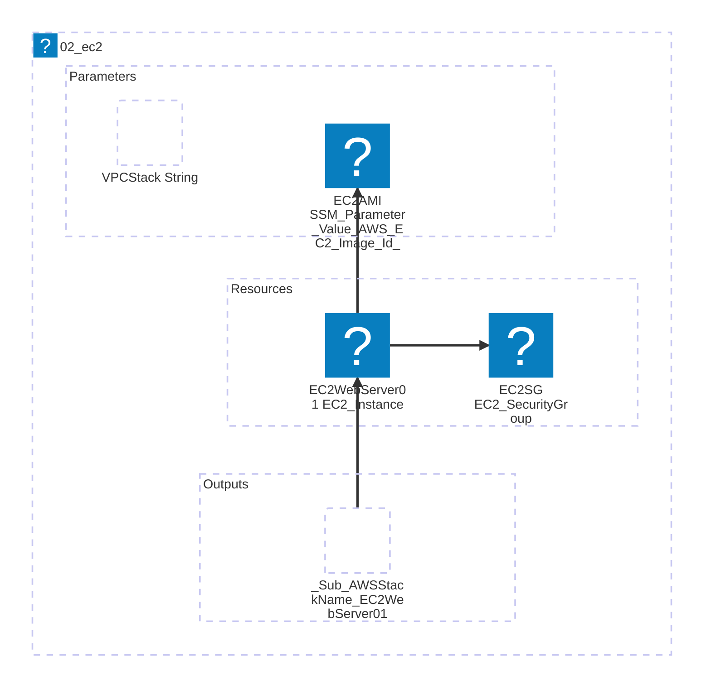

```mermaid
architecture-beta
  group 02_ec2(logos:aws-cloudformation)[02_ec2]
  group resources[Resources] in 02_ec2
  group parameters[Parameters] in 02_ec2
  group outputs[Outputs] in 02_ec2

  service EC2WebServer01(logos:logos:aws-ec2)[EC2WebServer01 EC2_Instance] in resources
  service EC2SG(logos:logos:aws-shield)[EC2SG EC2_SecurityGroup] in resources

  service VPCStack[VPCStack String] in parameters
  service EC2AMI(logos:logos:aws-secrets-manager)[EC2AMI SSM_Parameter_Value_AWS_EC2_Image_Id_] in parameters

  service param__EC2WebServer01[_Sub_AWSStackName_EC2WebServer01] in outputs

  EC2WebServer01:T --> B:EC2AMI
  EC2WebServer01:R --> L:EC2SG
  EC2WebServer01:B <-- T:param__EC2WebServer01

```
