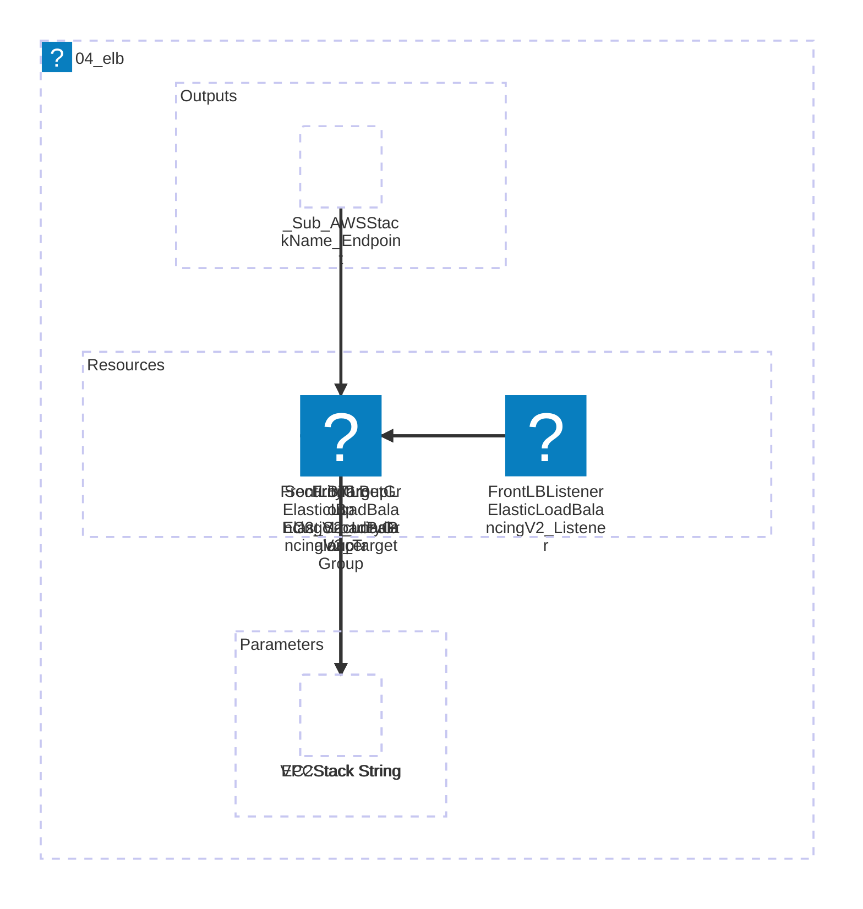

```mermaid
architecture-beta
  group 04_elb(logos:aws-cloudformation)[04_elb]
  group resources[Resources] in 04_elb
  group parameters[Parameters] in 04_elb
  group outputs[Outputs] in 04_elb

  %% Resources
  service FrontLB(logos:logos:aws-elb)[FrontLB ElasticLoadBalancingV2_LoadBalancer] in resources
  service FrontLBListener(logos:logos:aws-elb)[FrontLBListener ElasticLoadBalancingV2_Listener] in resources
  service FrontLBTargetGroup(logos:logos:aws-elb)[FrontLBTargetGroup ElasticLoadBalancingV2_TargetGroup] in resources
  service SecurityGroupLB(logos:logos:aws-shield)[SecurityGroupLB EC2_SecurityGroup] in resources

  %% Parameters
  service VPCStack[VPCStack String] in parameters
  service EC2Stack[EC2Stack String] in parameters

  %% Outputs
  service param__FrontLBEndpoint[_Sub_AWSStackName_Endpoint] in outputs

  %% Edges
  FrontLB:B --> T:VPCStack
  FrontLB:L --> R:SecurityGroupLB
  FrontLBListener:L --> R:FrontLB
  FrontLBListener:L --> R:FrontLBTargetGroup
  FrontLBTargetGroup:B --> T:VPCStack
  FrontLBTargetGroup:B --> T:EC2Stack
  SecurityGroupLB:B --> T:VPCStack
  param__FrontLBEndpoint:B --> T:FrontLB

```
