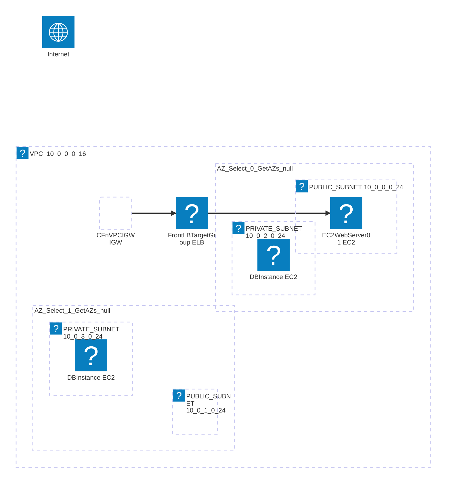

```mermaid
architecture-beta
  %% --- Internet ---
  service internet(internet)[Internet]
  %% --- VPC: 10_0_0_0_16 ---

  group f0_vpc_CFnVPC(logos:aws-vpc)[VPC_10_0_0_0_16]

  %% AvailabilityZone: Select_0_GetAZs_null
  group f0_vpc_CFnVPC_Select_0_GetAZs_null[AZ_Select_0_GetAZs_null] in f0_vpc_CFnVPC
  group f0_vpc_CFnVPC_PublicSubnet1(logos:aws-batch)[PUBLIC_SUBNET 10_0_0_0_24] in f0_vpc_CFnVPC_Select_0_GetAZs_null
  service f0_vpc_CFnVPC_PublicSubnet1_EC2WebServer01(logos:logos:aws-ec2)[EC2WebServer01 EC2] in f0_vpc_CFnVPC_PublicSubnet1
  group f0_vpc_CFnVPC_PrivateSubnet1(logos:aws-batch)[PRIVATE_SUBNET 10_0_2_0_24] in f0_vpc_CFnVPC_Select_0_GetAZs_null
  service f0_vpc_CFnVPC_PrivateSubnet1_DBInstance(logos:logos:aws-rds)[DBInstance EC2] in f0_vpc_CFnVPC_PrivateSubnet1

  %% AvailabilityZone: Select_1_GetAZs_null
  group f0_vpc_CFnVPC_Select_1_GetAZs_null[AZ_Select_1_GetAZs_null] in f0_vpc_CFnVPC
  group f0_vpc_CFnVPC_PublicSubnet2(logos:aws-batch)[PUBLIC_SUBNET 10_0_1_0_24] in f0_vpc_CFnVPC_Select_1_GetAZs_null
  group f0_vpc_CFnVPC_PrivateSubnet2(logos:aws-batch)[PRIVATE_SUBNET 10_0_3_0_24] in f0_vpc_CFnVPC_Select_1_GetAZs_null
  service f0_vpc_CFnVPC_PrivateSubnet2_DBInstance(logos:logos:aws-rds)[DBInstance EC2] in f0_vpc_CFnVPC_PrivateSubnet2
  %% ELB
  service f0_vpc_CFnVPC_FrontLBTargetGroup(logos:logos:aws-elb)[FrontLBTargetGroup ELB] in f0_vpc_CFnVPC
  f0_vpc_CFnVPC_FrontLBTargetGroup:R --> L:f0_vpc_CFnVPC_PublicSubnet1_EC2WebServer01
  %% IGW
  service f0_vpc_CFnVPC_CFnVPCIGW[CFnVPCIGW IGW] in f0_vpc_CFnVPC
  f0_vpc_CFnVPC_CFnVPCIGW:R --> L:f0_vpc_CFnVPC_FrontLBTargetGroup

```
